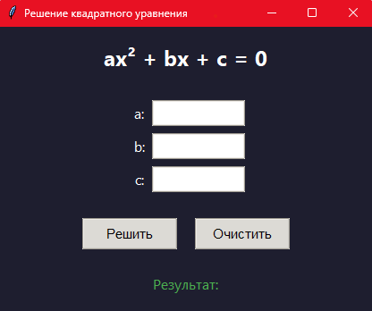

# Решение квадратных уравнений
Данный проект предназначен для решения квадратных уравнений вида  ax<sup>2</sup> + bx + c = 0 . Программа позволяет вводить коэффициенты, вычислять корни и отображать результат в удобном интерфейсе.


## Скриншот интерфейса



*Пример главного окна программы*

## Функциональность

Программа предоставляет следующие возможности:

* ввод коэффициентов a, b, c через удобные поля интерфейса;
* автоматическая проверка корректности входных данных;
* вычисление дискриминанта D = b<sup>2</sup> - 4ac;
* определение количества действительных корней;
* отображение результатов с округлением до 3 знаков после запятой;
* очистка полей ввода одним кликом;
* обработка ошибок с понятными сообщениями для пользователя.

## Как использовать

1. Запустите программу: выполните команду python main.py в терминале или запустите код из верхней правой панели инструментов (Run).
2. Введите коэффициенты:
   * a: — коэффициент при x<sup>2</sup>;
   * b: — коэффициент при x;
   * c: — свободный член.
3. Получите результат: нажмите кнопку «Решить» — программа отобразит корни или сообщение об ошибке.
4. Очистите поля: нажмите кнопку «Очистить», чтобы сбросить все значения и начать заново.

## Обрабатываемые сценарии

| Ввод                     | Результат | Описание |
|--------------------------|-----------|----------|
| a=1, b=-3, c=2           | [1.0, 2.0] | Два действительных корня |
| a=1, b=-2, c=1           | [1.0] | Один корень (D=0) |
| a=1, b=0, c=1            | «Действительных корней нет» | Нет действительных корней (D<0) |
| a=0, b=2, c=3            | «Это не квадратное уравнение» | Коэффициент a=0 |
| a = abc, b=2, c=3 | Диалоговое окно: «Введите корректные числа!» | Некорректный формат ввода |

## Системные требования

* Python: версия 3.6 или выше;
* Библиотеки: стандартные библиотеки Python (`tkinter`, `math`), не требуют отдельной установки.

## Структура проекта

```text
Project/
├── main.py                # Основной скрипт программы          
├── README.md              # Документация
└── screenshots/           
    └── main_window.png    # Скриншот интерфейса
```

## Ключевые функции кода

### quadratic_equation(a, b, c)

      Вычисляет корни квадратного уравнения.
      Уравнение имеет вид: a*x^2 + b*x + c = 0.

      Параметры:
         a — коэффициент при x^2,
         b — коэффициент при x,
         c — свободный член.

      Возвращает:
         1. list: список корней уравнения (один или два корня),
         2. Строку с сообщением об ошибке:
            - если a = 0 — «Это не квадратное уравнение»
            - если дискриминант < 0 — «Действительных корней нет»
         3. Диалоговое окно — «Введите корректные числа!»

### solve()

      Обрабатывает нажатие кнопки «Решить».

      Получает значения коэффициентов из полей ввода, вызывает функцию вычисления корней и 
      отображает результат в интерфейсе пользователя.

      В случае ошибки ввода выводит сообщение об ошибке.
### clear()

      Очищает поля ввода и результат.

      Удаляет введённые значения коэффициентов и сбрасывает отображаемый результат,
      позволяя пользователю начать ввод заново.

## Установка и запуск
   
1. Клонируйте репозиторий:
   ```bash
   git clone <url-репозитория>
   ```
   
2. Создайте виртуальное окружение:
   ```bash
   python -m venv venv
   ```
3. Запустите программу:
   ```bash
   python main.py
   ```

## Автор

Маханькова Вероника
   
## Лицензия
Этот проект является открытым и может быть использован, изменен и распространен без ограничений. Однако рекомендуется указывать авторство кода при его использовании или модификации.

Метка проекта: Veronika, автор: Veronika