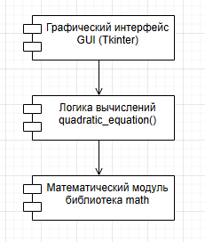
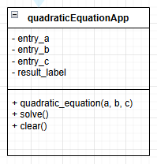
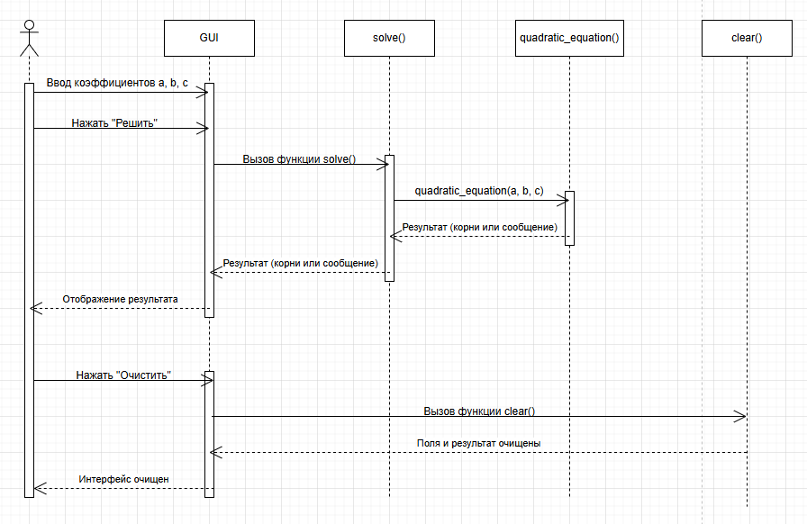
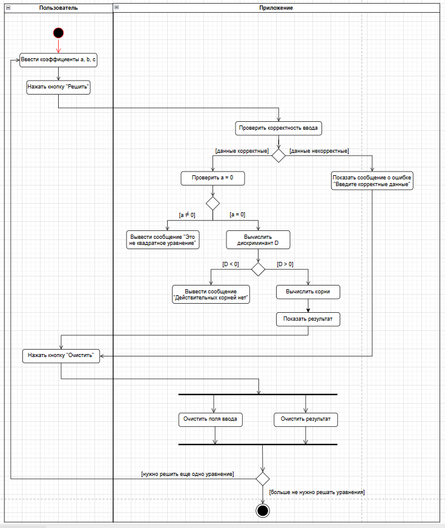
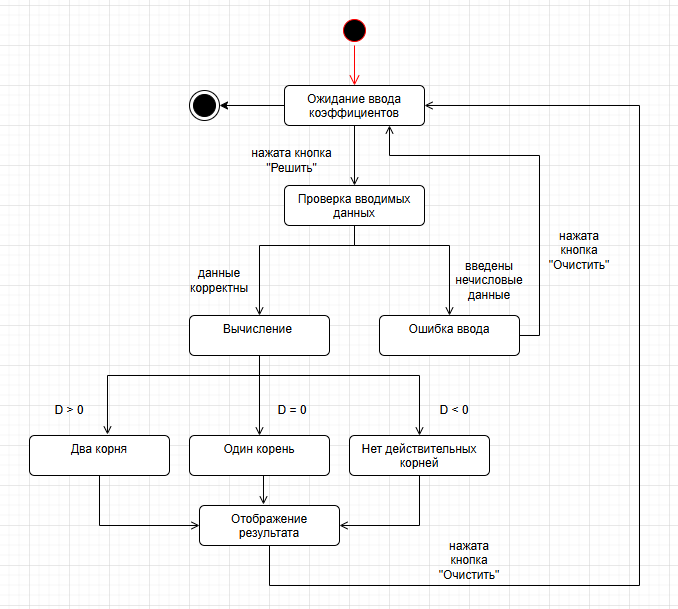
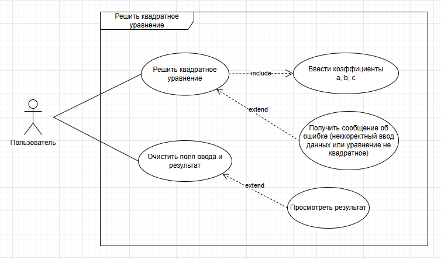

# Отчет по моделированию проекта

---

## Цель работы

Целью работы является построение высокоуровневых моделей программного обеспечения, изучение структурных и поведенческих UML-диаграмм, а также анализ свойств и недостатков разрабатываемой системы.

---

## Описание проектируемого ПО

Данный проект предназначен для решения квадратных уравнений вида  ax2 + bx + c = 0 . 

### Функциональность

Программа предоставляет следующие возможности:

* ввод коэффициентов a, b, c через удобные поля интерфейса;
* автоматическая проверка корректности входных данных;
* вычисление дискриминанта D = b2 - 4ac;
* определение количества действительных корней;
* отображение результатов с округлением до 3 знаков после запятой;
* очистка полей ввода одним кликом;
* обработка ошибок с понятными сообщениями для пользователя.

---

## Высокоуровневые модели системы

###  Диаграмма компонентов (структурная модель)

**Описание:**  
Система состоит из:
- GUI (графический интерфейс пользователя);
- модуля вычислений;
- математического модуля (библиотеки `math`).

---

### Диаграмма классов (структурная модель)

**Описание:**  
Диаграмма классов отражает логическую структуру программы.  
Основной класс включает:
- функцию `quadratic_equation()` для вычисления корней;
- функцию `solve()` для обработки ввода пользователя;
- функцию `clear()` для очистки интерфейса.

Атрибуты класса представлены элементами интерфейса (поля ввода и поле вывода результата).

---

### Диаграмма последовательности (поведенческая модель)

**Описание:**  
Диаграмма показывает взаимодействие пользователя, графического интерфейса и функций программы при ввводе коэффициентов квадратного уравнения, вычислении корней и очистке данных.

---

### Диаграмма деятельности (поведенческая модель)

**Описание:**  
Отражает алгоритм решения квадратного уравнения от ввода данных до получения результата.

---

### Диаграмма состояний (поведенческая модель)

**Описание:**  
Описывает состояния приложения:
- ввод данных;
- проверка;
- вычисление;
- отображение результата.

---

### Диаграмма сценариев (поведенческая модель)

**Описание:**  
Показывает основные сценарии использования программы пользователем.

---

## Анализ свойств разработанного ПО

### Преимущества
* простой и понятный интерфейс;
* удобство использования;
* обработка ошибок ввода;
* небольшое количество зависимостей;
* кроссплатформенность Python.
### Недостатки
* отсутствие поддержки комплексных корней;
* отсутствие истории вычислений;
* нет сохранения результатов;
* отсутствует модульное разделение программы;
* интерфейс и логика находятся в одном файле.

### Возможные улучшения

В дальнейшем возможно:

* добавление поддержки комплексных корней;
* разделение проекта на модули;
* подключение базы данных;
* создание истории вычислений;
* добавление графиков функций.

## Вывод

В ходе выполнения работы были построены высокоуровневые структурные и поведенческие UML-модели программного обеспечения.

Были выполнены:

* диаграмма вариантов использования;
* диаграмма классов;
* диаграмма последовательности;
* диаграмма деятельности.

Также была произведена детализация системы на нескольких уровнях и выполнен анализ свойств и недостатков разработанного программного обеспечения.

Таким образом, были успешно освоены методы UML-моделирования и анализа архитектуры программных систем.