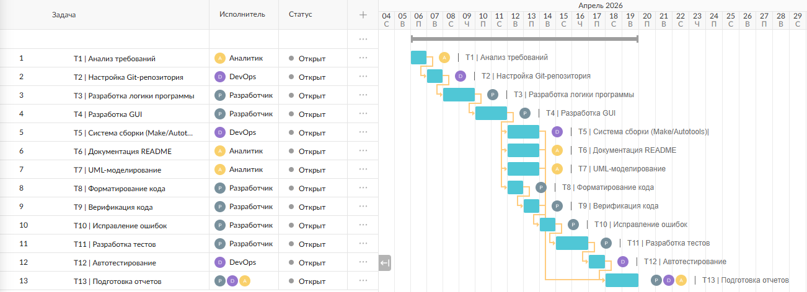
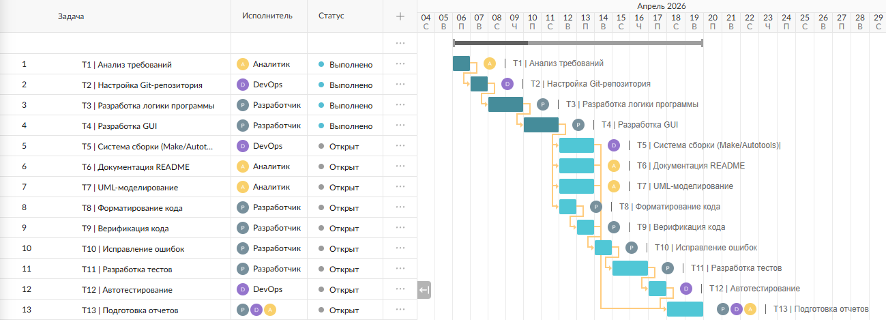
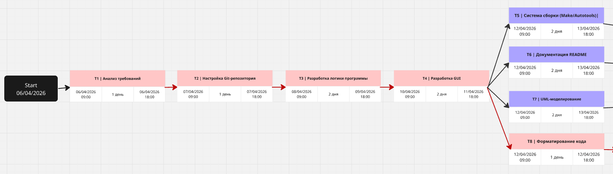
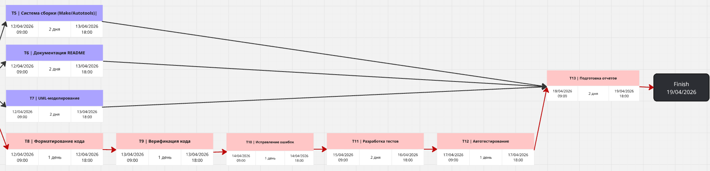

# Отчет по планированию проекта

---

## Цель работы

Целью данной лабораторной работы является освоение методов планирования проекта и управления ресурсами.

В ходе выполнения работы необходимо:
- составить план проекта, включающий не менее 10 задач;
- определить не менее 3 участников проекта и распределить между ними задачи;
- выделить не менее 3 ключевых точек (этапов) проекта;
- выполнить распределение ресурсов (время, стоимость, исполнители) для каждой задачи;
- определить участки параллельного выполнения задач (не менее 3 одновременно);
- построить диаграммы Ганта для начального и промежуточного состояния проекта;
- построить диаграмму PERT;
- определить критический путь проекта.

---

## Описание проекта

Проект представляет собой разработку приложения на Python с графическим интерфейсом (tkinter), предназначенного для решения квадратных уравнений вида:

ax² + bx + c = 0

Функциональность:
- ввод коэффициентов;
- вычисление корней уравнения;
- обработка ошибок;
- графический интерфейс пользователя.

---

## Участники проекта

| Участник | Роль |
|----------|------|
| Вероника  | Разработчик |
| Анастасия | DevOps |
| Екатерина | Аналитик |

Примечание: несмотря на формальное распределение ролей между участниками проекта, все задачи в рамках данного проекта были выполнены одним исполнителем.
Распределение ролей произведено условно с целью моделирования командной разработки и выполнения требований задания.

---

## План проекта

| ID | Задача                          | Исполнитель | Длительность |
|----|---------------------------------|-------------|---------------|
| T1 | Анализ требований               | Екатерина | 1 день |
| T2 | Настройка Git-репозитория       | Анастасия | 1 день |
| T3 | Разработка логики программы     | Вероника | 2 дня |
| T4 | Разработка GUI                  | Вероника | 2 дня |
| T5 | Система сборки (Make/Autotools) | Анастасия | 2 дня |
| T6 | Документация README             | Екатерина | 2 дня |
| T7 | UML-моделирование               | Екатерина | 2 дня |
| T8 | Форматирование кода             | Вероника | 1 день |
| T9 | Верификация кода                | Вероника | 1 день |
| T10 | Исправление ошибок              | Вероника | 1 день |
| T11 | Разработка тестов               | Вероника | 2 дня |
| T12 | Автотестирование                | Анастасия | 1 день |
| T13 | Подготовка отчетов              | Все участники | 2 дня |

---

## Ключевые точки проекта

| № | Ключевая точка | Описание     |
|---|----------------|--------------|
| M1 | Начало разработки | T1–T2 завершены |
| M2 | Основная разработка | T3–T4 завершены |
| M3 | Тестирование и исправление ошибок | T8–T12 завершены |
| M4 | Завершение проекта | T13 завершен |
---

## Распределение ресурсов

### Ставки участников

| Роль | Ставка |
|------|---------|
| Разработчик | 4000 руб./день |
| DevOps | 3000 руб./день |
| Аналитик | 3500 руб./день |

---

### Стоимость задач

Стоимость рассчитывается по формуле:

```text
Стоимость = длительность × ставка исполнителя
```

| ID  | Задача             | Исполнитель   | Дни | Стоимость |
| --- | ------------------ | ------------- | --- | --------- |
| T1  | Анализ требований  | Екатерина     | 1   | 3500 руб. |
| T2  | Git-репозиторий    | Анастасия     | 1   | 3000 руб. |
| T3  | Логика программы   | Вероника      | 2   | 8000 руб. |
| T4  | GUI                | Вероника      | 2   | 8000 руб. |
| T5  | Система сборки     | Анастасия     | 2   | 6000 руб. |
| T6  | UML                | Екатерина     | 2   | 7000 руб. |
| T7  | Документация       | Екатерина     | 2   | 7000 руб. |
| T8  | Форматирование     | Вероника      | 1   | 4000 руб. |
| T9  | Верификация        | Вероника      | 1   | 4000 руб. |
| T10 | Исправление ошибок | Вероника      | 1   | 4000 руб. |
| T11 | Разработка тестов  | Вероника      | 2   | 8000 руб. |
| T12 | Автотестирование   | Анастасия     | 1   | 3000 руб. |
| T13 | Итоговый отчет     | Все участники | 2   | 7000 руб. |

### Общая стоимость проекта

**72 500 руб.**

---

## Диаграмма Ганта (начальный план)



*На диаграмме Ганта представлен первоначальный план проекта с распределением задач по времени, указанием зависимостей между этапами и участков параллельного выполнения работ.*

---

## Диаграмма Ганта (промежуточное состояние проекта)



*Диаграмма отражает промежуточное состояние проекта, включая завершенные, выполняемые и еще не начатые задачи.*

---

## Диаграмма PERT


*PERT-диаграмма отображает зависимости между задачами проекта и позволяет определить последовательность выполнения работ, а также критический путь проекта.*



*PERT-диаграмма проекта (часть 1)*




*PERT-диаграмма проекта (часть 2)*

---

## Критический путь

Критический путь — это последовательность взаимосвязанных задач, определяющая минимально возможное время выполнения проекта.

Задачи, входящие в критический путь, не имеют временного резерва. Задержка любой из этих задач приводит к увеличению общей длительности проекта.

```
T1 → T2 → T3 → T4 → T8 → T9 → T10 → T11 → T12 → T13
1 + 1 + 2 + 2 + 1 + 1 + 1 + 2 + 1 + 2 = 14 дней
```

---

## Вывод

В ходе выполнения лабораторной работы был разработан план проекта, включающий более 10 задач, определены участники проекта и ключевые этапы его реализации.

Было выполнено распределение ресурсов (время, стоимость, исполнители), а также выделены участки параллельного выполнения задач.

Построены диаграммы Гантта для начального и промежуточного состояния проекта и диаграмма PERT, на основе которой определён критический путь.

Таким образом, были успешно освоены основные методы планирования и управления программными проектами.
